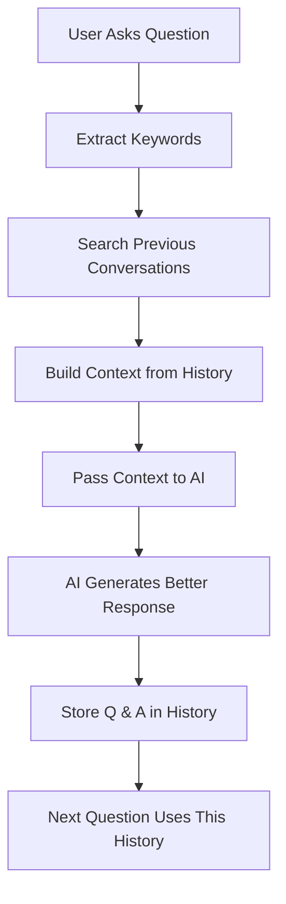

# Conversation History Feature - Quick Start Guide

## 🎯 What This Feature Does

**Old Way:** Each question was independent - no memory of previous questions  
**New Way:** System remembers all previous questions and uses them to provide better answers

---

## 📊 How It Works (Step by Step)



---

## 💾 Data Flow

### Example 1: First Question
```
User: "How do I sort a list in Python?"
↓
AI: "Result: Use sorted()...\nCode: sorted([3,1,2])..."
↓
Stored in history with tags: ["code_generation"]
```

### Example 2: Related Question
```
User: "What about sorting dictionaries?"
↓
System finds: Previous "sort list" conversation
↓
Context added: "User previously learned about sorting lists using sorted()..."
↓
AI: Explains dictionary sorting while maintaining consistency with list sorting style
↓
Stored in history
```

### Example 3: General Search Question
```
User: "Show me searching algorithms"
↓
Keywords: ["searching", "algorithms"]
↓
Relevant conversations found: 2
↓
Context: "Based on previous sorting and list discussions..."
↓
AI generates response consistent with previous code style
```

---

## 🚀 Using the API

### 1. Generate Code (Automatic History!)
```bash
curl -X POST "http://localhost:8000/generate" \
  -H "Content-Type: application/json" \
  -d '{
    "prompt": "Sort a list of numbers"
  }'
```
✨ **Automatically stores this conversation!**

---

### 2. View Your Conversation History
```bash
curl "http://localhost:8000/history?limit=5"
```
Response:
```json
{
  "conversations": [
    {
      "user_prompt": "Sort a list of numbers",
      "ai_response": "Result: ...",
      "timestamp": "2024-01-15T10:30:00"
    }
  ],
  "count": 1
}
```

---

### 3. Get Topic Statistics
```bash
curl "http://localhost:8000/history/stats"
```
Response:
```json
{
  "total_conversations": 10,
  "top_topics": {
    "python": 7,
    "function": 5,
    "list": 4
  }
}
```

---

### 4. Search Previous Conversations
```bash
curl "http://localhost:8000/history/search?keyword=python"
```
Response:
```json
{
  "keyword": "python",
  "conversations": [
    {
      "user_prompt": "Sort a list of numbers in Python",
      "ai_response": "..."
    }
  ],
  "count": 1
}
```

---

## 🔍 Understanding the AI Context

When you ask a question, the system:

1. **Finds Related Conversations**
   - Extracts keywords from your question
   - Searches through all previous Q&As
   - Finds the 3 most relevant conversations

2. **Creates Context Summary**
   ```
   Based on previous conversation history, here's what we've been working on:
   
   Previous 1:
     User asked: How do I sort a list?
     We responded: Use sorted()...
   
   Common topics discussed: python, list, sorting
   ```

3. **Passes to AI**
   - AI sees this context
   - AI knows about your previous questions
   - AI can maintain consistency

---

## 📈 Benefits

| Scenario | Without History | With History |
|----------|-----------------|--------------|
| Similar question | Generic answer | Builds on previous answer |
| Code style | Might change | Stays consistent |
| Explanations | Always basic | Adapted to user's level |
| Context | No memory | Remembers everything |

---

## 🛠️ Behind the Scenes

### File Structure
```
project/
├── models/
│   └── conversation.py          # Data models
├── services/
│   ├── history_service.py       # Store & retrieve
│   ├── history_analysis.py      # Analyze & extract context
│   └── ai_service.py            # Updated to use context
├── routes/
│   └── generate.py              # Updated endpoints
└── data/
    └── conversation_history.json # Where history is stored
```

### Storage Format
```json
{
  "conversations": [
    {
      "id": "unique-id",
      "user_prompt": "How do I sort?",
      "ai_response": "Use sorted()...",
      "timestamp": "2024-01-15T10:30:00",
      "tags": ["code_generation"]
    }
  ]
}
```

---

## ⚙️ Configuration

### Default Behavior
- ✅ History automatically enabled
- ✅ Stores all conversations
- ✅ Uses 3 most relevant previous conversations as context
- ✅ Keywords extracted intelligently

### Customization Options
Edit `services/history_analysis.py` to:
- Change number of relevant conversations: `limit: int = 3`
- Change minimum keyword length: `len(w) >= 3`
- Change number of top topics: `most_common(15)`

---

## 📝 Example Conversations

### Session Example
```
Q1: Generate a Python function to reverse a list
A1: Stores with tags: ["code_generation", "prompt"]

Q2: How do I do this with a string instead?
A2: System finds Q1, passes context
    AI response maintains consistency

Q3: What about sorting instead of reversing?
A3: System finds Q1 and Q2, passes both
    AI provides coherent progression
```

---

## 🔄 When History is Used

History context is **ALWAYS** added to every new question. The AI service automatically:
- Includes recent conversation context in the system prompt
- Tells AI to maintain consistency with previous answers
- References common topics discussed

---

## 🧹 Managing History

### View Statistics
```bash
curl "http://localhost:8000/history/stats"
```

### Search for Specific Topic
```bash
curl "http://localhost:8000/history/search?keyword=function"
```

### Clear All History
```bash
curl -X POST "http://localhost:8000/history/clear"
```

---

## 🎓 Learning the System

Each conversation that's stored helps the system understand:
- ✅ What topics you're interested in
- ✅ Your preferred explanation style  
- ✅ Your coding level and preferences
- ✅ Patterns in what you ask

This makes every subsequent answer better and more personalized!

---

## 📚 Documentation Files
- [HISTORY_FEATURE.md](HISTORY_FEATURE.md) - Complete technical documentation
- [models/conversation.py](models/conversation.py) - Data structures
- [services/history_service.py](services/history_service.py) - Storage logic
- [services/history_analysis.py](services/history_analysis.py) - Analysis logic
